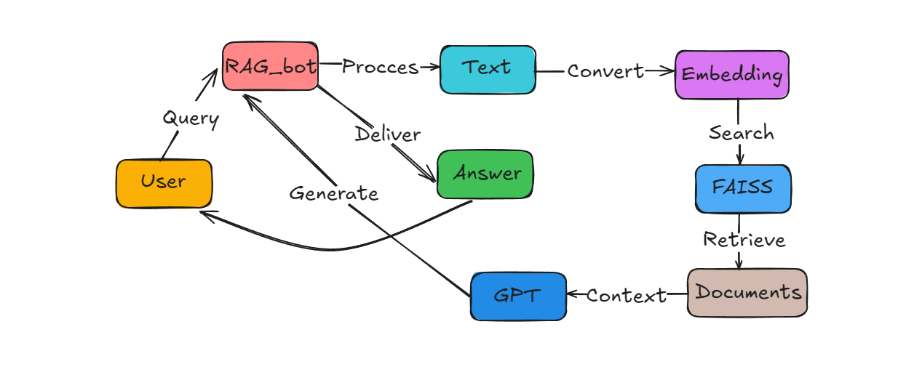

# Article Assistant (RAG Telegram Bot) 


**Live Bot**: [@RAG_Engineering_bot](https://t.me/RAG_Engineering_bot)

**My contact**: [@Konstantin_vanov](https://t.me/Konstantin_vanov)

Telegram bot for Q&A about articles using Retrieval-Augmented Generation. Indexes web content and provides accurate answers with sources.


## 🌟 Features

- **Smart Indexing** - Processes articles from any URL
- **Multilingual** - Supports English/Russian questions and answers
- **Custom Prompts** - Control response style and format
- **Proxy Support** - Works with OpenAI API in restricted regions
- **Source Citing** - Always shows evidence for answers
- **Persistent Storage** - Remembers indexed articles between sessions

## ⚠️ Demo version limitations
- **Maximum 3 user requests per day**
- **After the limit, you will need your own API key**

## 🚀 Quick Start

### Prerequisites
- Python 3.9+
- [Telegram Bot Token](https://core.telegram.org/bots#how-do-i-create-a-bot)
- [OpenAI API Key](https://platform.openai.com/api-keys)

### RAG System Workflow

1. **Input Query**  




### Installation
```bash
git clone https://github.com/Konstantin-vanov-hub/RAG_bot.git
cd RAG-bot
python -m venv venv
source venv/bin/activate  # Linux/Mac
venv\Scripts\activate     # Windows
pip install python-dotenv==1.1.1
pip install -r requirements.txt
Configuration
Create .env file:

bash
cp .env.example .env
Add your credentials:

ini
TELEGRAM_TOKEN=your_bot_token
OPENAI_API_KEY=your_openai_key
# Optional for Russia:
PROXY_API_URL=https://api.proxyapi.ru/openai/v1
Launch
bash
python RAG_bot.py
🎮 Usage Guide
Basic Flow
Start bot with /start

Add article via "Enter article" button

Ask questions using "Ask question" option

Command Reference
Action	Command	Description
Start	/start	Initialize bot
Add Article	"Enter article"	Index new content
Ask Question	"Ask question"	Get answers
Change Language	"Change language"	Switch EN/RU
Prompt Settings	"Prompt settings"	Customize responses
Examples
User: https://lilianweng.github.io/posts/2023-03-15-prompt-engineering/
Bot: "✅ Article indexed! Processed 15 chunks"

User: "What is chain-of-thought prompting?"
Bot: "Answer: A technique that breaks down problems into intermediate reasoning steps...\n\n- Improves complex reasoning by 23%\n- Works best with models >50B parameters\n- Different from standard few-shot learning"

⚙️ Technical Details
Architecture
Diagram
Code

Stack
Core: Python 3.9, LangChain 0.3+

Vector DB: FAISS

Embeddings: OpenAI text-embedding-3-small

LLM: GPT-4

Parsing: BeautifulSoup4

Cache: Local FAISS index storage

🛠 Troubleshooting
Issue	Solution
API Key Error	Verify .env file exists
Empty Responses	Check article URL validity
Slow Indexing	Reduce chunk_size in indexer.py
Proxy Errors	Test API endpoint with curl
Encoding Issues	Set LANG=C.UTF-8 in environment
📜 License
MIT License © 2025 Konstantin

🤝 Contributing
Fork the repository

Create feature branch (git checkout -b feature/improvement)

Commit changes (git commit -am 'Add new feature')

Push to branch (git push origin feature/improvement)

Open Pull Request

📬 Support
For assistance, please open an issue or contact @Konstantin_vanov

